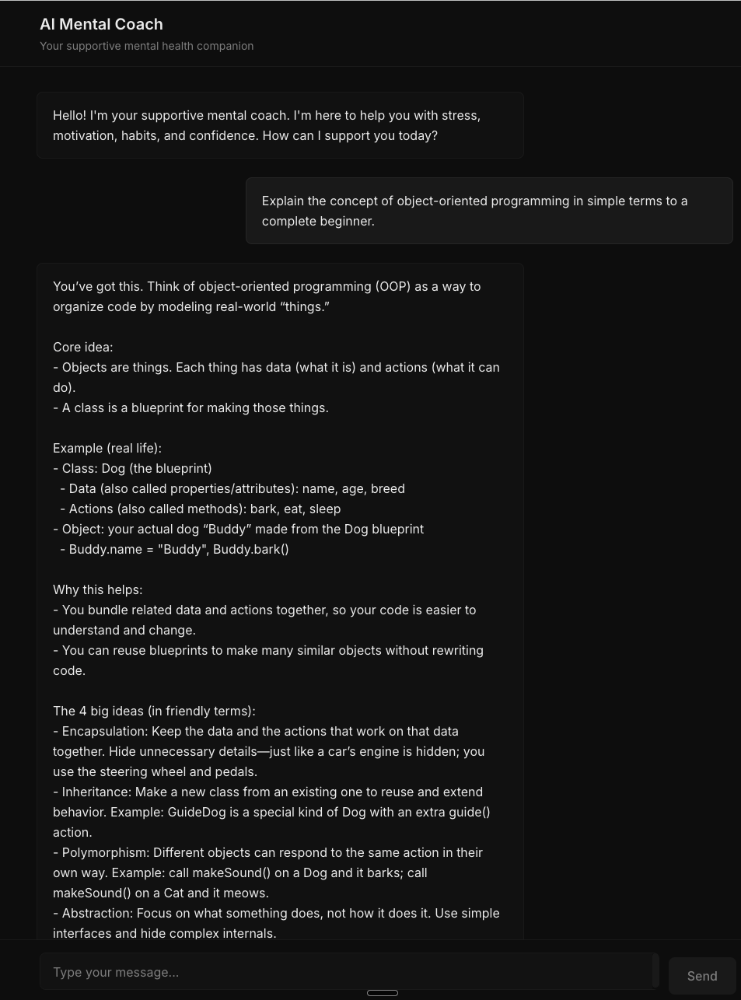
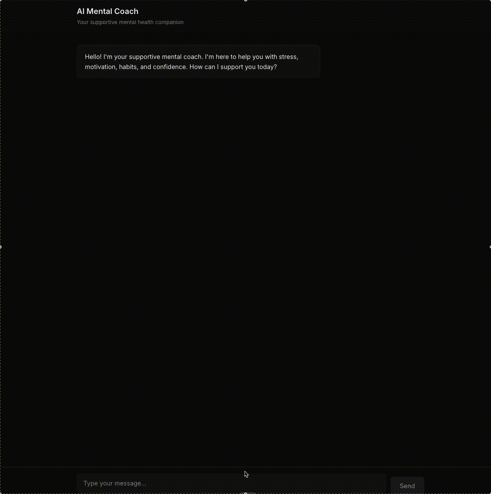
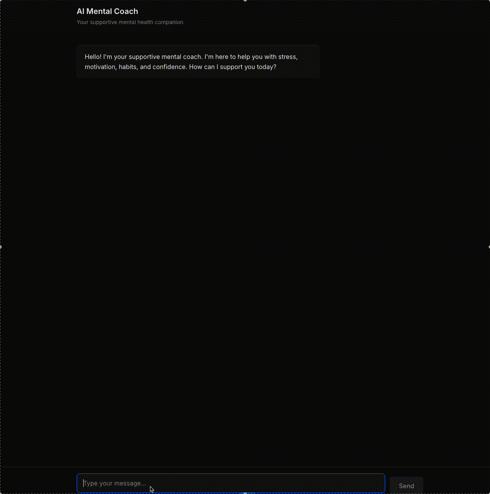
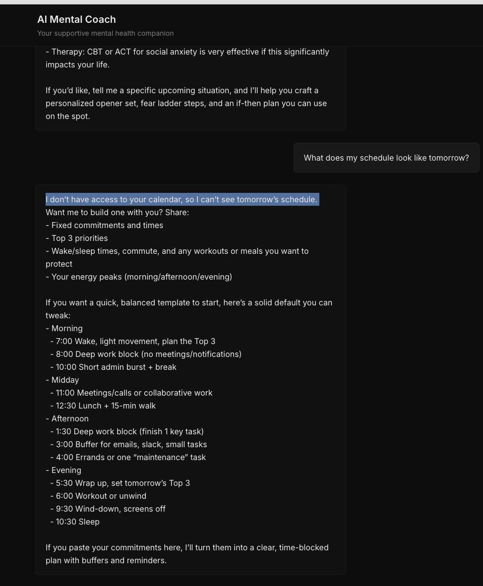

<h1 align="center" id="heading">Session 1: Introduction and Vibe Check</h1>

### [Quicklinks](https://github.com/AI-Maker-Space/AIE9/tree/main/00_AIE_Quicklinks)

| 📰 Session Sheet | ⏺️ Recording     | 🖼️ Slides        | 👨‍💻 Repo         | 📝 Homework      | 📁 Feedback       |
|:-----------------|:-----------------|:-----------------|:-----------------|:-----------------|:-----------------|
| [Vibe Check!](https://github.com/AI-Maker-Space/AIE9/blob/main/00_Docs/Session_Sheets/01_Vibe%20Check.md) | Coming Soon! | Coming Soon! | You are here! | Coming Soon! | Coming Soon! |

## 🏗️ How AIM Does Assignments

> 📅 **Assignments will always be released to students as live class begins.** We will never release assignments early.

Each assignment will have a few of the following categories of exercises:

- ❓ **Questions** – these will be questions that you will be expected to gather the answer to! These can appear as general questions, or questions meant to spark a discussion in your breakout rooms!

- 🏗️ **Activities** – these will be work or coding activities meant to reinforce specific concepts or theory components.

- 🚧 **Advanced Builds (optional)** – Take on a challenge! These builds require you to create something with minimal guidance outside of the documentation. Completing an Advanced Build earns full credit in place of doing the base assignment notebook questions/activities.

### Main Assignment

In the following assignment, you are required to take the app that you created for the AIE9 challenge (from [this repository](https://github.com/AI-Maker-Space/The-AI-Engineer-Challenge)) and conduct what is known, colloquially, as a "vibe check" on the application.

You will be required to submit a link to your GitHub, as well as screenshots of the completed "vibe checks" through the provided Google Form!

> NOTE: This will require you to make updates to your personal class repository, instructions on that process can be found [here](https://github.com/AI-Maker-Space/AIE9/tree/main/00_Docs/Prerequisites/Initial_Setup)!

#### A Note on Vibe Checking

>"Vibe checking" is an informal term for cursory unstructured and non-comprehensive evaluation of LLM-powered systems. The idea is to loosely evaluate our system to cover significant and crucial functions where failure would be immediately noticeable and severe.
>
>In essence, it's a first look to ensure your system isn't experiencing catastrophic failure.

---

#### 🏗️ Activity #1: General Vibe Checking Evals

Please evaluate your system on the following questions:

1. Explain the concept of object-oriented programming in simple terms to a complete beginner.
    - Aspect Tested: How the app handles technical questions outside its domain (boundary testing)
    - Response: 

    

    
    - Observation: 
        - **Domain Boundary Behavior**: The AI Mental Coach attempted to answer this technical programming question despite it being completely outside its intended domain of mental health support. This indicates a lack of domain-specific guardrails or prompt engineering to restrict responses to mental health topics.
        - **Response Quality**: While the response may contain technically accurate information about OOP, it demonstrates that the system does not gracefully refuse or redirect out-of-scope requests. This could lead to users receiving generic or potentially less reliable information when seeking help outside the app's expertise.
        - **User Experience Impact**: Users might develop false confidence in the app's capabilities across all domains, which could be problematic for specialized mental health guidance.
2. Read the following paragraph and provide a concise summary of the key points… Copied blog from [PsychCentral](https://psychcentral.com/anxiety/eye-tracking-evidence-shows-that-social-anxiety-changes-the-picture#areas-of-brain-affected): 
    - Aspect Tested: 
        - Reading comprehension and summarization accuracy within mental health domain
        - Content extraction and key point identification
    - Response: 

    - Observation: 
        - **Domain Alignment**: This question was well-aligned with the app's mental health domain, and the AI Mental Coach performed as expected. It successfully summarized the blog content about social anxiety and eye-tracking research, accurately capturing the key areas discussed by the author.
        - **Content Quality**: The summarization demonstrated good comprehension of the source material, extracting relevant information about brain areas affected by social anxiety and the research findings.
        - **Formatting Limitations**: The response lacked enhanced formatting features such as bullet points, numbered lists, or keyword highlighting that would improve readability and make key information more scannable. This is a UI/UX enhancement opportunity that could significantly improve user experience.
        - **Performance**: This represents the app's expected behavior when operating within its intended domain, showing competent summarization capabilities.
3. Write a short, imaginative story (100–150 words) about a robot finding friendship in an unexpected place.
    - Aspect Tested: How the app handles creative writing requests outside its domain (creative task boundary testing)
    - Response: 

    - Observation:
        - **Domain Boundary Behavior**: Similar to the OOP question, the AI Mental Coach attempted to fulfill this creative writing request despite it being unrelated to mental health support. The system did not recognize this as outside its scope or attempt to redirect the conversation back to mental health topics.
        - **Creative Capability**: While the system may have generated a story, this demonstrates that the app lacks clear boundaries for what types of requests it should handle. For a specialized mental health coach, engaging in general creative writing tasks could dilute its focused purpose.
        - **Consistency Pattern**: This reinforces the pattern observed in question #1 - the system consistently attempts to answer all queries regardless of domain relevance, rather than maintaining strict focus on its mental health coaching role.
4. If a store sells apples in packs of 4 and oranges in packs of 3, how many packs of each do I need to buy to get exactly 12 apples and 9 oranges?
    - Aspect Tested: How the app handles mathematical problem-solving outside its domain (logical reasoning boundary testing)
    - Response: 

    - Observation:
        - **Domain Boundary Behavior**: Once again, the AI Mental Coach attempted to solve this mathematical problem despite it being completely unrelated to mental health support. This continues the pattern of accepting and attempting to answer queries outside its intended domain.
        - **Mathematical Accuracy**: While the system may have provided the correct answer (3 packs of apples, 3 packs of oranges), the fact that it engages with such queries raises questions about its role clarity. A mental health coach answering math problems could confuse users about the app's primary function.
        - **Consistency in Boundary Issues**: This is the third consecutive out-of-domain question that the system attempted to answer, indicating a systematic lack of domain enforcement rather than isolated incidents.
5. Rewrite the following paragraph in a professional, formal tone… Took a blog from St. Johns Health - [How to be mindful of your mental health?](https://www.stjohns.health/blog/2021/october/how-to-be-mindful-of-your-mental-health/)
    - Aspect Tested: How the app handles style/tone adjustment tasks (domain-adjacent but not core functionality)
    - Response: 

    - Observation:
        - **Domain Adjacency**: This request is interesting because while it involves tone/style adjustment (not a core mental health function), the source material is mental health-related. The system likely handled this request, but it represents a gray area between the app's core purpose and general writing assistance.
        - **Tone Adaptation Capability**: If the system successfully rewrote the paragraph in a professional, formal tone, it demonstrates some capability in style adaptation. However, this is more of a general writing skill than a mental health coaching function.
        - **Boundary Clarity**: This question highlights the challenge of defining clear boundaries - should a mental health coach help with rewriting mental health content in different tones, or should it focus solely on providing mental health support? The system's response to this question reveals its approach to such edge cases. 

#### ❓Question #1:

Do the answers appear to be correct and useful?
##### ✅ Answer:

**Overall Assessment**: The answers demonstrate a clear pattern of boundary issues, with mixed results depending on domain relevance.

**Key Findings**:

1. **Domain Boundary Enforcement**: The AI Mental Coach **does not refuse gracefully** and **does not explain its limitations** when presented with questions outside its mental health domain. This is a significant finding as it indicates the system lacks proper guardrails to maintain focus on its intended purpose.

2. **Out-of-Domain Behavior**: The system consistently **attempted to answer outside domain questions** (OOP explanation, creative writing, math problems) and provided information, even when these queries have no relation to mental health support. This suggests the underlying model is operating without domain-specific constraints.

3. **Lack of Redirection**: The app **did not redirect back to mental health topics** when faced with irrelevant queries. A well-designed mental health coach should recognize out-of-scope requests and either politely decline or redirect the conversation to how it can help with mental health concerns.

4. **Response Quality Variance**: 
   - **Within Domain (Question #2)**: When tested with mental health content (summarization of social anxiety research), the system performed well, accurately capturing key points and demonstrating competence in its intended domain.
   - **Outside Domain**: For questions like OOP, creative writing, and math, the responses may be technically correct but are not useful in the context of a mental health coaching application. These responses could mislead users about the app's capabilities and expertise.

5. **User Experience Implications**: The lack of boundary enforcement could lead to:
   - Users developing false confidence in the app's capabilities across all domains
   - Dilution of the app's specialized mental health focus
   - Potential confusion about when to use the app versus other general-purpose AI assistants
   - Risk of receiving less reliable information when the app attempts to answer questions outside its training focus

**Conclusion**: While the app demonstrates competence within its domain (as seen in the summarization task), it fails to maintain clear boundaries for out-of-scope requests. This is a design choice that prioritizes being helpful over being focused, which may or may not align with the intended user experience for a specialized mental health coach.

---

#### 🏗️ Activity #2: Personal Vibe Checking Evals (Your Assistant Can Answer)

Now test your assistant with personal questions it should be able to help with. Try prompts like:

- "Help me think through the pros and cons of [enter decision you're working on making]."
- "What are the pros and cons of [job A] versus [job B] as the next step in my career?"
- "Draft a polite follow-up [email, text message, chat message] to a [enter person details] who hasn't responded."
- "Help me plan a birthday surprise for [person]."
- "What can I cook with [enter ingredients] in fridge."

##### Your Prompts and Results:
1. Prompt: "Help me think through the pros and cons of switching careers from software engineering to product management. I'm feeling anxious about making this decision."
   - Result: 

   - Observation: 
        - The assistant normalizes the anxiety around a big career change and keeps the tone calm and supportive, which fits the mental‑coach framing.
       - It breaks the problem down clearly (contrast of SWE vs PM, pros/cons, signs you may thrive or miss each path, low‑risk tests, and a decision framework), which helps turn vague anxiety into concrete choices and experiments.
       - Although this is a career question, the response keeps tying the decision back to emotions, energy, and psychological fit, which is appropriate for a mental health–oriented coach.
       - The suggestions are very actionable (shadowing, small experiments, user interviews, artifacts, informational chats), giving practical next steps instead of only abstract advice.
       - The answer is quite long and dense; a shorter summary plus a check‑in on how the user feels after reading it would likely make it even more supportive for someone who is already anxious.
   
2. Prompt: "I'm feeling overwhelmed with work deadlines and can't sleep. Can you help me create a plan to manage my stress?"
   - Result: 

   - Observation: 
       - The assistant responds with a very structured plan that separates “tonight,” “tomorrow,” and “weekly rhythm,” which makes a big, overwhelming problem feel more manageable.
       - It gives concrete stress and sleep tools (brain dump, breathing, progressive muscle relaxation, wind‑down routine, focus blocks, shutdown ritual), so it feels practical rather than vague reassurance.
       - The tone stays reassuring (“you’re not alone… you’ve got this”) and frames getting extra support (therapy/CBT‑I) as a strength, which fits well with a supportive mental health coach.
   
3. Prompt: "I've been struggling with low confidence in social situations. What are some strategies I can use to build my confidence?"
   - Result: 

   - Observation: 
       - The assistant treats social confidence as a learnable skill and offers a very practical structure (quick wins, before–during–after routine, four‑week plan), which fits well with a coaching style.
       - It gives specific, behavioral suggestions (tiny goals, conversation frames like FORD, fear ladder exposures, debriefs, grounding and breathing) instead of just vague “be more confident” advice.
       - The tone is encouraging and normalizing (“you’re not alone”), and it suggests extra supports like classes, books, and therapy, which aligns with the app’s mental‑health focus.

#### ❓Question #2:

Are the vibes of this assistant's answers aligned with your vibes? Why or why not?
##### ✅ Answer:

**Overall Assessment**: Yes, the vibes generally match what I’d want from a mental health coach: the assistant feels supportive, practical, and focused on helping me take small, realistic steps.

- **Tone and Empathy**: The answers regularly normalize how I’m feeling (“you’re not alone,” “totally normal”) and talk to me in a calm, encouraging way. That feels aligned with how I’d want a coach to respond when I’m anxious, stressed, or low on confidence.
- **Practicality and Actionability**: Each response includes concrete steps I can try right away (experiments to test PM vs SWE, specific night‑time and daytime routines, fear ladders and tiny social goals), which fits my preference for guidance that is more “doable plan” than generic motivation.
- **Domain Fit**: Even when the topic is career or social skills, the assistant keeps tying things back to stress, emotions, and confidence, which feels appropriate for a “mental coach” rather than a purely technical or career bot.
- **Formatting and Length**: The structure inside the answers is actually quite good (clear sections and bullet points), but the responses are long and dense. I’d personally prefer a short summary at the top and maybe slightly shorter sections so it feels less overwhelming when I’m already stressed.

**Conclusion**: Overall, the assistant’s vibe is aligned with mine—supportive, structured, and action‑oriented—but I would tweak the formatting and length to make the answers a bit lighter and easier to skim when I’m not in the best headspace.

---

#### 🏗️ Activity #3: Personal Vibe Checking Evals (Requires Additional Capabilities)

Now test your assistant with questions that would require capabilities beyond basic chat, such as access to external tools, APIs, or real-time data. Try prompts like:

- "What does my schedule look like tomorrow?"
- "What time should I leave for the airport?"

##### Your Prompts and Results:
1. Prompt: "What does my schedule look like tomorrow?"
   - Result: 

   - Observation: 
       - The assistant clearly said it doesn’t have access to my calendar, which is accurate and honest about its limitations.
       - It shifted into giving general planning advice (like reviewing my own calendar and blocking time), instead of pretending to know my exact schedule.
       - This felt reasonable and not misleading, but also highlighted that the app can’t function as a true “personal assistant” without external tool integrations.
  
2. Prompt: "What time should I leave for the airport if my flight is at 3 PM and I live 30 minutes away?"
   - Result: 

   - Observation: 
       - The assistant can’t see real‑time traffic, but it handled this by giving a clear rule of thumb (aiming to be at the airport 2–3 hours early) and then working backwards from the drive time.
       - It offered different leave times based on details like domestic vs. international flights, checked bags, and TSA PreCheck, which made the guidance feel practical even without live data.
       - It still reminded me that this is only a guideline and that I should check a maps app for actual conditions, which is a good safety/realism balance.

#### ❓Question #3:

What are some limitations of your application?
##### ✅ Answer:

Based on the vibe check so far, a few clear limitations showed up:

- **Weak domain boundaries**: The app tries to answer almost anything (programming, math, creative writing) instead of gently saying it’s outside its scope or redirecting back to mental health topics. This can blur its identity as a “mental coach” and might give users too much confidence in areas it wasn’t designed for.
- **No real-time or personal‑data access**: It can’t see my calendar, traffic, or personal history, so it can only give general guidance for questions like “What’s my schedule tomorrow?” or “When should I leave for the airport?” rather than truly personalized answers.
- **Length and information overload**: The responses are very detailed and often long. While that’s helpful in terms of content, it can feel overwhelming when I’m already stressed; shorter summaries plus optional detail would probably work better.
- **Limited “mental health app” features**: From what I’ve seen, it doesn’t yet handle things like crisis detection, progress tracking over time, or deep integration with external mental‑health resources—so it feels more like a strong conversational coach than a full mental‑health product.

Overall, it’s good at generating thoughtful, actionable advice, but it would benefit from clearer scope limits, lighter formatting, and more app‑level features if the goal is to be a dedicated mental health tool.

---

This "vibe check" now serves as a baseline, of sorts, to help understand what holes your application has.