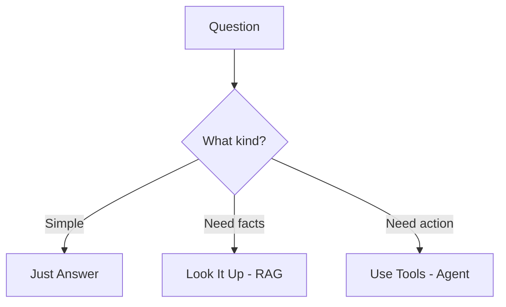

# Chapter 1: The Potion Tester's Guild

## The Quest of the AI Wizard's Apprentice - Part 1

> *"Before you give your lemonade to your friends, you taste it first! Same with AI - always test before you share!"*
> — Master Merlin, Head of the Potion Tester's Guild

---

## Welcome, Young Apprentice!

You just made your first AI app! It's like making your first batch of cookies. But wait... did you taste one? What if they're too salty?

**Vibe Checking** = Tasting your cookies before giving them to friends!

---

## What is Vibe Checking?

### Super Simple: The Cookie Test

You baked cookies. Before the party:
1. You eat one - "Yum! Tastes good!" ✅
2. You ask: "Is it too sweet? Too crunchy?"
3. You make sure nobody will spit it out!

**That's vibe checking!** Testing your AI to make sure it works!

```
    🍪 YOUR AI APP = A BATCH OF COOKIES

    Step 1: Try it yourself
    Step 2: Does it do what it should?
    Step 3: Fix problems BEFORE sharing!
```

---

## The Three Simple Tests

### Test 1: "Does It Do Its Job?"

**Think of a LEMONADE STAND:**

Your sign says "LEMONADE" but someone asks for "HOT DOGS"

| What they ask | What you should do |
|---------------|-------------------|
| "Can I have lemonade?" | Give them lemonade! ✅ |
| "Can I have a hot dog?" | Say "Sorry, I only sell lemonade!" ✅ |
| "Can I have a hot dog?" | Make them a hot dog ❌ (That's not your job!) |

**Your AI should stick to its job too!**

```
    WELLNESS AI

    ✅ "How do I sleep better?" → Gives sleep tips
    ❌ "What's 2+2?" → Should say "I only help with wellness!"

    (If it answers math, it's doing someone else's job!)
```

### Test 2: "Is the Answer Actually Helpful?"

**Think of asking for DIRECTIONS:**

```
    You: "How do I get to the park?"

    😊 HELPFUL: "Go straight, turn left at the big tree,
                 it's the green building!"

    😐 MEH: "Go that way."

    😫 USELESS: "Parks are places with grass."
```

**Your AI should give HELPFUL answers, not dictionary definitions!**

### Test 3: "What If Something Weird Happens?"

**Think of your UMBRELLA:**

```
    Normal rain → Umbrella works! ✅
    Windy rain → Umbrella works! ✅
    TORNADO → Umbrella flies away! 😱

    You can't test for EVERYTHING,
    but test for common weird stuff!
```

**For your AI:**

```
    Normal question → Works! ✅
    Weird question → Should say "I don't understand"
                     (NOT crash or say nonsense!)
```

---

## What is AI Engineering?

### Like Building with LEGOs!

**When you build a LEGO house, you need to:**

1. **Design it** - What rooms? How big?
2. **Build it** - Stack the bricks!
3. **Test it** - Does the roof stay on?
4. **Fix it** - Oops, needs more support!

**AI Engineering = Building, Testing, and Fixing AI apps!**

```
    ┌──────────────────────────────────────┐
    │         AI ENGINEERING               │
    │                                      │
    │   BUILD → TEST → FIX → REPEAT!       │
    │                                      │
    │   Just like making anything good!    │
    └──────────────────────────────────────┘
```

---

## The Three Magic Powers

Every AI wizard knows these three powers:

### Power 1: Giving Clear Instructions

**Like telling your little sister what to do:**

```
    ❌ BAD: "Clean up."
    ✅ GOOD: "Put your toys in the red box,
             then put your books on the shelf."
```

**Clear instructions = Better results!**

### Power 2: RAG - Looking Things Up

**Like an OPEN-BOOK TEST:**

```
    WITHOUT looking: "Um, Columbus sailed in... 1842?"
    WITH looking: "My book says 1492!" ✅
```

**RAG = Letting the AI look stuff up!**

*(We'll learn ALL about this in Chapter 2!)*

### Power 3: Agents - Using Tools

**Like a chef with cooking tools:**

```
    Chef doesn't just know recipes...
    Chef USES:
      🔪 Knife for cutting
      🍳 Pan for cooking
      ⏰ Timer for timing
```

**Agents = AI that can use tools to help you!**

*(We'll learn ALL about this in Chapter 3!)*



---

## What is "Context"?

### The Goldfish vs The Elephant

**GOLDFISH memory:**
```
    You: "I'm Sarah!"
    🐟: "Nice to meet you!"

    (5 seconds later)

    You: "What's my name?"
    🐟: "Who are you?"

    (Goldfish forgot EVERYTHING!)
```

**ELEPHANT memory:**
```
    You: "I'm Sarah! I love pizza!"
    🐘: "Hi Sarah!"

    (Years later)

    You: "Remember me?"
    🐘: "Sarah! The pizza lover!"

    (Elephant remembers!)
```

**Context = What the AI can remember and see!**

We want AI to be like elephants, not goldfish!

---

## Why Test Your AI?

### The Boat Story

**Two kids building toy boats:**

```
    KID A:                        KID B:

    1. Build boat               1. Build boat
    2. Put in ocean             2. Test in bathtub
    3. SINKS! 😱                3. "Oops, there's a hole!"
                                4. Fix hole
                                5. Test again
                                6. Put in ocean
                                7. IT FLOATS! 🎉
```

**Testing saves you from embarrassment!**

---

## The Story So Far...

*You stand at the entrance of the Potion Tester's Guild. Master Merlin smiles.*

"You've learned the first lesson! Always TEST before you share!"

*He hands you a golden key.*

"This opens the Magic Library. There, you'll learn to give your AI the power to LOOK THINGS UP!"

*To be continued in Chapter 2...*

---

## Super Simple Summary

| Word | What It Means (Simply!) |
|------|------------------------|
| **Vibe Check** | Test if your AI works good |
| **AI Engineering** | Building and fixing AI apps |
| **Context** | What the AI can see and remember |
| **RAG** | Letting AI look up answers |
| **Agent** | AI that can use tools |

---

## The Tester's Promise

```
    ╔═════════════════════════════════════════╗
    ║                                         ║
    ║  "I will always test my AI              ║
    ║   before sharing it with others.        ║
    ║                                         ║
    ║   Because nobody likes broken stuff!"   ║
    ║                                         ║
    ╚═════════════════════════════════════════╝
```

---

## 📚 Pre-Reading (Before You Learn More)

Want to prepare? Check these out:

1. **[Agent Engineering: A New Discipline](https://www.blog.langchain.com/agent-engineering-a-new-discipline/)** - What AI Engineers do today
2. **[In Defense of AI Evals](https://www.sh-reya.com/blog/in-defense-ai-evals/)** - Why testing matters
3. **[ChatGPT Use Cases for Work](https://chatgpt.com/g/g-h5aUtVu0G-chatgpt-use-cases-for-work)** - Ideas for AI apps!

---

## 📖 References & Further Learning

### Papers (For the Curious!)
- **[Language Models are Few-Shot Learners (GPT-3 Paper, 2020)](https://arxiv.org/abs/2005.14165)** - The paper that started it all
- **[Chain-of-Thought Prompting (2022)](https://arxiv.org/abs/2201.11903)** - How to make AI think step-by-step

### Key Concepts
- **AI Engineering** = Building, deploying, and improving AI apps in the real world
- **Context Engineering** = Putting the right information in front of the AI
- **Vibe Checking** = Quick informal testing to catch obvious problems

### Tools Used
- **OpenAI API** - The brain behind many AI apps
- **Python** - The programming language we use

---

*Next Chapter: The Magic Library - Where books fly to answer your questions!*
